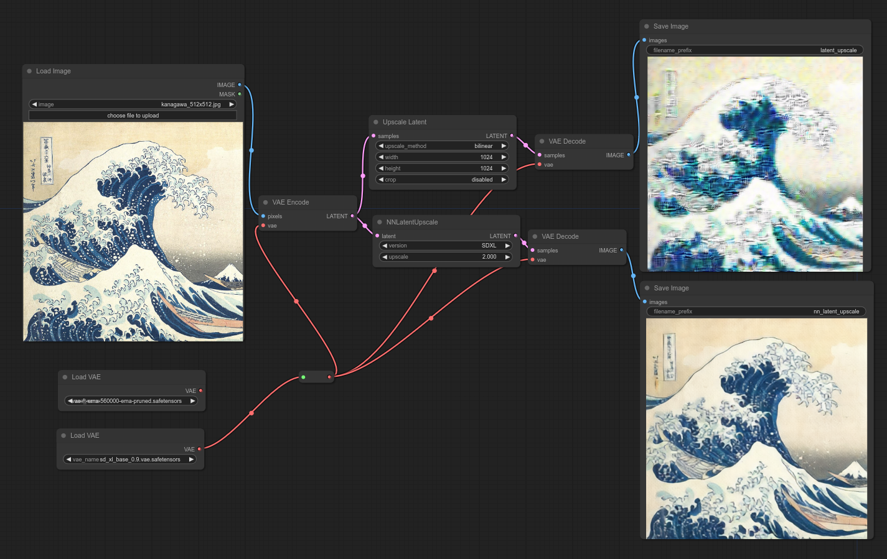
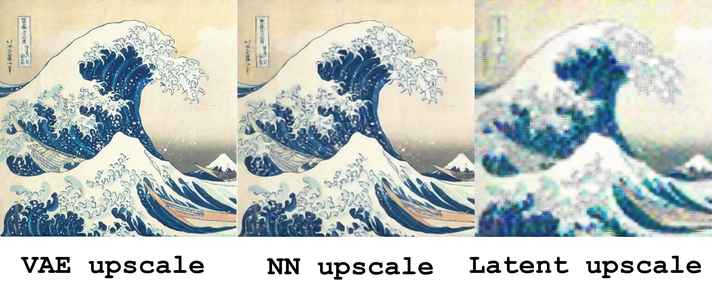

# ComfyUI Neural network latent upscale custom node

This repository includes a custom node for
[ComfyUI](https://github.com/comfyanonymous/ComfyUI) for upscaling the latents
quickly using a small neural network without needing to decode and encode with
VAE. The node can be found in "Add Node -> latent -> NNLatentUpscale".

This node is meant to be used in a workflow where the initial image is
generated in lower resolution, the latent is upscaled and the upscaled latent is
fed back into the stable diffusion u-net for low noise diffusion pass (high-res
fix).

Compared to VAE decode -> upscale -> encode, the neural net latent upscale is
about 20 - 50 times faster depending on the image resolution with minimal
quality loss. Compared to direct linear interpolation of the latent the neural
net upscale is slower but has much better quality. Direct latent interpolation
usually has very large artifacts.

## Installation

Clone this repository in ComfyUI `custom_nodes` directory with: `git clone https://github.com/Ttl/ComfyUi_NNLatentUpscale.git`.

## Evaluation

Dataset: [COCO 2017](https://cocodataset.org.org) validation images center
cropped to 256x256 resolution. The comparison image is linear upscale of the
input image. All tests are done with fp32 precision and batch size 4.

VAE Upscale: VAE decode -> Linear interpolation -> Encode.

NN Upscale: Neural network upscale (This repository).

Latent Upscale: Linear interpolation of latent.

SDXL, 2x upscale:

|                      | MSE ↓  | LPIPS ↓ | PSNR ↑ | Time (ms) ↓ |
|----------------------|--------|---------|--------|-------------|
| VAE Upscale          | 0.009 | 0.22    | 26.9   | 832         |
| NN Upscale           | 0.010 | 0.28    | 26.3   | 36          |
| Latent Upscale       | 0.047 | 0.65    | 19.5   | 0.1         |

SDXL, 1.5x upscale:

|                      | MSE ↓  | LPIPS ↓ | PSNR ↑ | Time (ms) ↓ |
|----------------------|--------|---------|--------|-------------|
| VAE Upscale          | 0.009 | 0.20    | 26.9   | 583         |
| NN Upscale           | 0.010 | 0.26    | 26.3   | 19          |
| Latent Upscale       | 0.038 | 0.58    | 20.4   | 0.1         |

SD 1.5, 2x upscale:

|                      | MSE ↓ | LPIPS ↓ | PSNR ↑ | Time (ms) ↓ |
|----------------------|-------|---------|--------|-------------|
| VAE Upscale          | 0.009 | 0.21    | 26.7   | 822         |
| NN Upscale           | 0.008 | 0.24    | 27.0   | 36          |
| Latent Upscale       | 0.033 | 0.61    | 20.9   | 0.1         |

SD 1.5, 1.5x upscale:

|                      | MSE ↓ | LPIPS ↓ | PSNR ↑ | Time (ms) ↓ |
|----------------------|-------|---------|--------|-------------|
| VAE Upscale          | 0.010 | 0.18    | 26.5   | 594         |
| NN Upscale           | 0.009 | 0.21    | 26.9   | 20          |
| Latent Upscale       | 0.031 | 0.52    | 21.3   | 0.1         |
